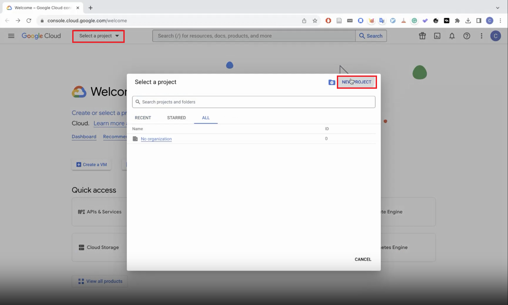
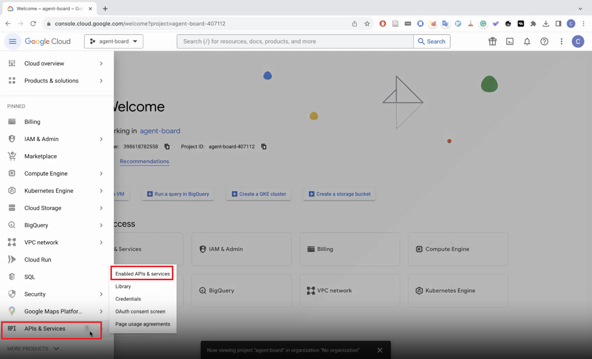
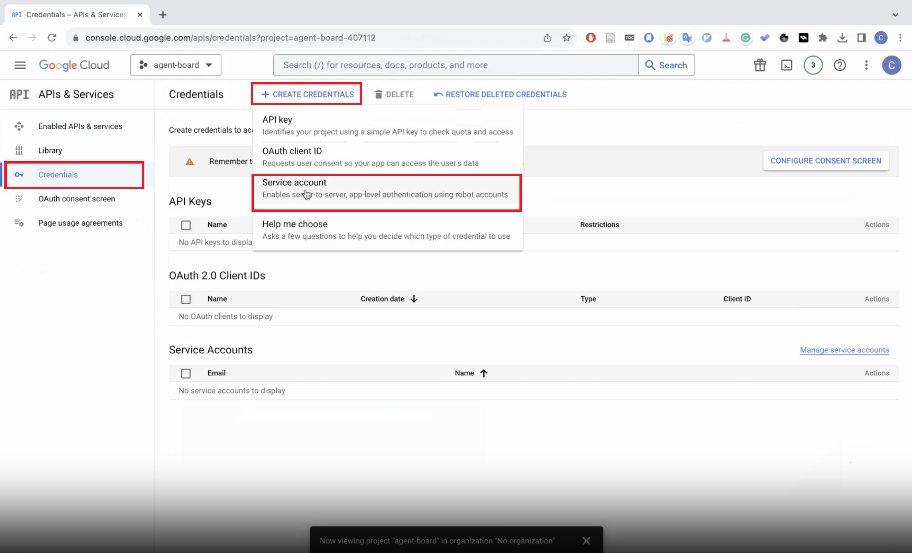
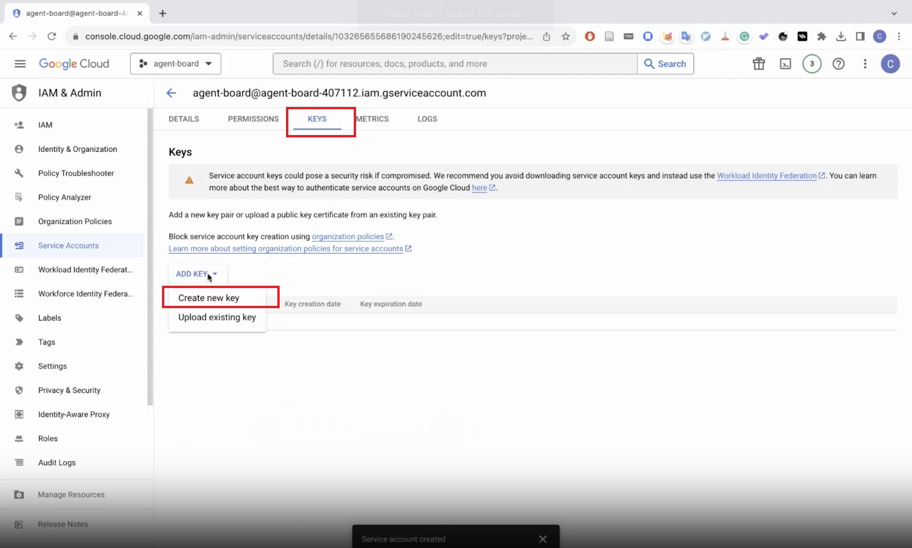

# API keys for Tool Tasks
In order to evaluate in **Tool** tasks, you need to get the following API keys and put them in `.env` file.


<p align="right"> <a href="../README.md">🔙Back to README.md</a> </p>

## 1. Academia
There is no need to get an API key for Academia.

## 2. Weather
There is no need to get an API key for Weather.

## 3. Movie
Step 1. Sign up an account in https://www.themoviedb.org/

Step 2. You can find your **API Read Access Token** in https://www.themoviedb.org/settings/api

Step 3. Put the **API Read Access Token** in `.env`:
```shell
MOVIE_KEY=${YOUR_API_READ_ACCESS_TOKEN}
```

## 4. Todo
Step 1. Sign up an account in https://todoist.com/

Step 2. You can find your **API Token** in https://todoist.com/app/settings/integrations/developer

Step 3. Put the **API Token** in `.env`:
```shell
TODO_KEY=${YOUR_TODO_API_TOKEN}
```


## 5. Sheet
> We provide a [video](https://hkust-nlp.notion.site/AgentBoard-9a755d1522df4c3ab07da47b9d20fff9) which shows how to obtain the Google Sheet    `credential.json` file.

> The orginal Google Sheet data is in this [link](https://docs.google.com/spreadsheets/d/17MVNCONh-6Pw3Met2O31WhUHlgOcQz8TPJKikVpL8IY/).

Step 1. Sign up a Google Account

Step 2. Sign in https://console.cloud.google.com/welcome

Step 3. Create a new project
<div style="text-align:center">
    
</div>

Step 4. Select the new project

Step 5. Select **API & Services**
<div style="text-align:center">
    
</div>

Step 6. Click **+ Enable APIS AND SERVICES**

Step 7. Search and Enable **Google Sheets API** and **Google Drive API**

Step 8. Click **API & Services/Credential** and click **+ CREATE CREDENTIALS**
<div style="text-align:center">
    
</div>

Step 9. After you create a service account, click the service account which you just created.

Step 10.  Click **KEYS**.

Step 11.  Click **ADD KEY**, then click **Create new key** and select **JSON**.
<div style="text-align:center">
    
</div>

Step 12. Name the file as `credential.json` and put it in  `agentboard/utils/sheet/`

Step 13. Put the **Google Account Email** in  `.env`: 
```shell
SHEET_EMAIL=${YOUR_GOOGLE_ACCOUNT_EMAIL}
```
